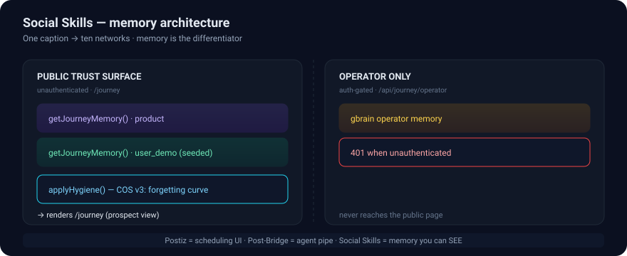

<p align="center">
  
</p>

<h1 align="center">Social Skills</h1>

<p align="center">
  <b>One caption. Ten networks. A memory layer you can see.</b><br/>
  <i>Cross-post desk for creators — with the memory graph as the differentiator.</i>
</p>

<p align="center">
  
  
  
  
  
</p>

---

## Why this exists

Most social tools are fire-and-forget. You post, it's gone, and next week
you start from zero. **Social Skills** is built around a **memory layer** that is
also the product's pitch:

- **Postiz** (FOSS self-host) is a scheduling UI with no memory of you.
- **Post-Bridge** is an agent pipe with no human-facing memory surface.
- **Social Skills** makes the memory *visible* — `/journey` shows what the app
  has learned about an account: brand voice, cadence, top platform, audience.

That journey view is the acquisition wedge. At zero signups a retention feature
has nobody to retain — so `/journey` ships as a **public, seeded trust
surface**: a prospect can *see* the memory thesis before they sign up.

## What it does

- ✍️ **Compose once** — one caption, optional media.
- 🌐 **Publish everywhere** — ten platforms, each transformed to its own rules
  (IG needs media, X strips links, Threads wants a question hook, LinkedIn
  keeps the long form).
- 🧠 **Learns per account** — brand voice, cadence, top platform, audience
  insight, surfaced on `/journey`.
- 📊 **SEO compare hub** — `/compare` pits Social Skills against 8 competitors.
- 🔒 **Operator memory stays private** — the agent's gbrain lives behind an
  auth gate (`/api/journey/operator`), never on the public page.

## Architecture

The memory split is the whole point (see diagram above):

| Surface | Route | Auth | What it exposes |
|----------|-------|------|----------------|
| **Public trust surface** | `GET /api/journey` | none | curated `product` memory + a seeded `user_demo` account |
| **Operator only** | `GET /api/journey/operator` | required | agent gbrain (returns `401` unauthenticated) |

Both run the result through `applyHygiene()` (Cognitive OS v3): signals fade on
a forgetting curve rather than being deleted, and credential-shaped text is
redacted at the boundary.

## Run it

```bash
cd social-skills
bun install
bun run dev        # http://localhost:3456
```

**Demo login:** `demo@socialskills.app` / `demo1234`

Set one of `OPENAI_API_KEY`, `XAI_API_KEY`, or `OPENROUTER_API_KEY` for live
caption improvement.

## Repo layout

```
src/app/         Next.js App Router (pages + API routes)
src/components/   client UI (DashboardApp, AuthForm, Shell)
src/lib/         store (in-memory db + journey seeds), auth, platforms, competitors
docs/            brainstorms + plans (compound-engineering workflow)
data/db.json     local store (gitignored)
```

## Development

Managed with the **compound-engineering** workflow:
`/ce-brainstorm` → `/ce-plan` → `/ce-work`.

- Active plan:
  [`docs/plans/2026-07-24-001-feat-public-journey-trust-surface-plan.md`](docs/plans/2026-07-24-001-feat-public-journey-trust-surface-plan.md)
- Requirements:
  [`docs/brainstorms/public-journey-trust-surface-requirements.md`](docs/brainstorms/public-journey-trust-surface-requirements.md)

## License

MIT — see [`LICENSE`](LICENSE).
